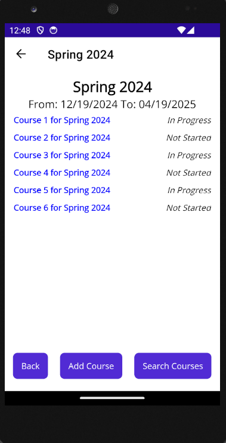

# EduTrack

**User Authentication**:  
- Secure registration and login using **SQLite** for user data management.
- **.NET MAUI**'s built-in authentication services for secure user authentication.

**Course and Assessment Management**:  
- Track academic terms, courses, and assessments.
- Add and manage courses.
- View progress and receive notifications.

## Technologies Used

- **.NET MAUI**: Cross-platform framework for building native mobile apps.
- **SQLite**: For local database management, storing user data, terms, courses, assessments, and notifications.
- **NUnit**: For testing, ensuring reliability and maintainability.

## Database Schema

The application uses **SQLite** for database management. Key models include:

- **User**: Stores user data such as email and authentication details.
- **Term**: Represents an academic term, managing related courses and assessments.
- **Course**: Stores course information including title, description, and associated assessments.
- **Assessment**: Manages tests, quizzes, and assignments related to the courses.
- **Notification**: Manages alerts and reminders for course deadlines and assessments.

## Features

- **User Authentication**: Secure login and registration with **SQLite**.
- **Course Management**: Add, update, and manage academic courses locally.
- **Term Management**: Manage academic terms and their associated courses and assessments.
- **Progress Tracking**: View and track your progress through assessments.
- **Notifications**: Receive alerts for upcoming deadlines and course activities.

## Screenshots

**UI**  

